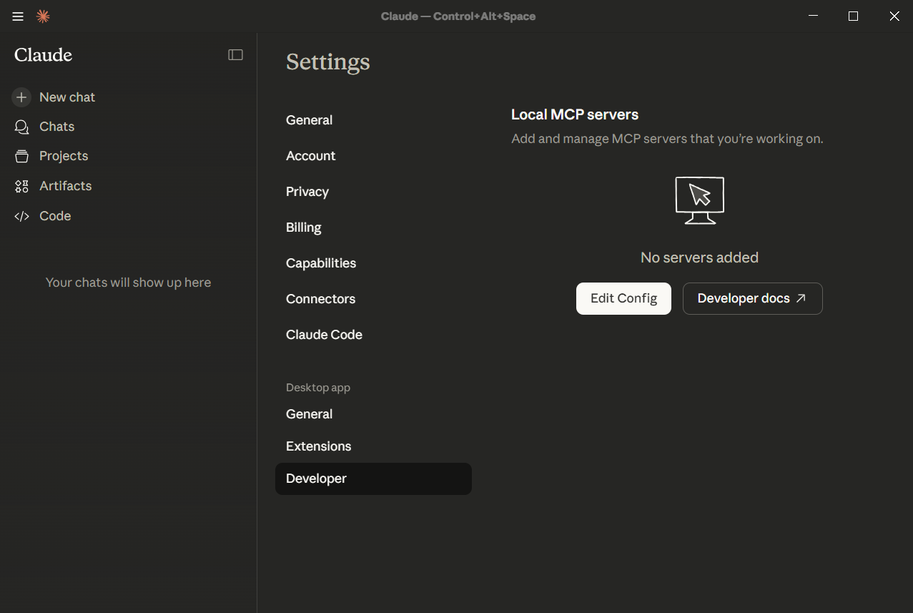
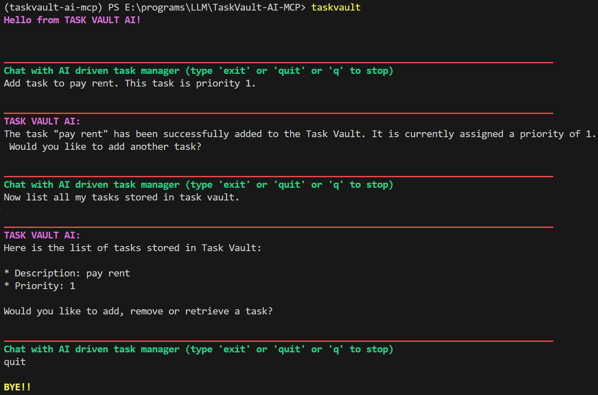

# TaskVault-AI-MCP

**Task Vault MCP Server** is a project designed to expose task management capabilities via an MCP server. It allows you to effortlessly create, store, and manage your tasks using just natural language. Whether you want to add a new to-do, check your agenda for the day, or look up details about a specific project, simply ask any MCP compatible LLM client. All your tasks are securely stored locally and easily retrievable, making personal organization as simple as a conversation.


## Features
- **Client Agnostic MCP Tools:** </br>
    Exposes a set of Model Context Protocol (MCP) tools for any client to use. Can be used by any MCP-compliant client to manage tasks.
- **ChromaDB Storage:**  </br>
    Uses ChromaDB to store tasks locally and reliably. This makes the tasks accessible between chat sessions and across different llm applications


## How It Works

1. **Storage:** The server uses ChromaDB to maintain the state of tasks.
2. **Access:** Clients connect to the server and utilize the exposed tools.
3. **Management:** Users can add, retrieve, and manage tasks through the MCP server interface to the LLM/MCP client.

# Installation

## Prerequisites
- Python3.12 or above
- uv package manager
- Ollama
- An MCP client (e.g., using Claude Desktop). The project also includes a simple cli based MCP client for quick setup.

## Steps to connect to the MCP server using Claude Desktop
> [!NOTE]
> This requires [paid plan](https://claude.com/pricing) of Claude Desktop.

1. Clone/download the repository
2. Download and install ollama from [Official Ollama Site](https://ollama.com/download)
3. Download  embedding model mxbai-embed-large by running </br>```ollama pull mxbai-embed-large```
4. Install Claude Desktop from [Official Claude Site](https://claude.com/download)
5. Go to developer settings in using Claude Desktop. </br>
(Settings -> Desktop App -> Developer -> Local MCP servers -> Edit config)

6. This opens folder with claude_desktop_config.json. Open this file and Paste the below code. Please change the absolute path to the repository.
    ```json
    {
    "mcpServers": {
        "task_storage_service": {
        "command": "uv",
        "args": [
            "--directory",
            "/<ABSOLUTE PATH TO REPO>/TaskVault-AI-MCP",
            "run",
            "task_storage_service"
        ]
        }
    }
    }
7. Restart Claude Desktop and start a new chat. the MCP server "task_storage_service" should be listed under Connectors.


## Steps to connect to the MCP server using using Ollama and inbuilt MCP client.
> [!NOTE]
> This is free but requires sufficient RAM to run small llm models like llama3.2. 
1. Clone/download the repository
2. Download and install ollama from [Official Ollama Site](https://ollama.com/download)
3. Download llm model llama3.2 and embedding model mxbai-embed-large by running </br>```ollama pull llama3.2; ollama pull mxbai-embed-large```
4. Run in cmd ```uv tool install . -e```.</br> This will automatically install all depedencies and create an executable taskvault.exe.
5. Run in cmd  ```taskvault```</br>
